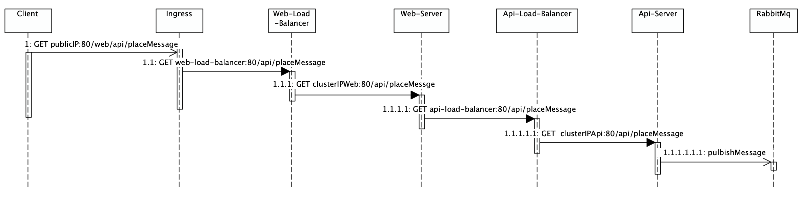
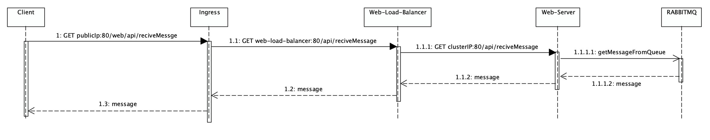

# repow

# API

## How to start 

### Install pipenv

```bash
pip install pipenv
```

### Enter virtual enviroment

```bash
cd api
pipenv shell
```

### Install dependencies from Pipfile

```bash
pipenv install
```

## Add new packages 

```bash
pipenv install package_name
```

## Run the application
```bash
uvicorn app.main:app --reload --port 8000
```

## Enviroment variables?

Create a .env file with key values like this: SECRET_KEY="HELLO NIBBA".

Pipenv will automatically detect it.

Get the variable: os.getenv("SECRET_KEY")

We will manually send the .env to each other for security. 

# Frontend

## How to start

### Install dependencies

```bash
npm install
```

## Run the application

```bash
npm run dev
```
## Add new packages

```bash
npm install package_name
```

# Local Deployment

I assume that you have docker, minikube and kubectl installed and working on your local machine.

All commands shown are executed from the root folder.

## Build Apps

Build the images for each microservice in the project.

```bash
docker build --no-cache -t api:latest /api
docker build --no-cache -t frontend:latest /frontend
```

### Add the images to minikube

```bash
minikube image load api:latest # minikube image rm api - for removing
minikube image load frontend:latest
```

### Deploy

Add the RabbitMQ Cluster Operator.

```bash
kubectl apply -f https://github.com/rabbitmq/cluster-operator/releases/latest/download/cluster-operator.yml
```

Apply all the deployment files inside the folder deployment.

```bash
kubectl apply -f deployment/
```

### Testing

Right now you cannot access the services inside the cluster, use minikube service to create a port-forward and get access to the front end via localhost.

```bash
minikube service frontend-service
```


# UML 

## Component and Connector

This view shows how each service communicates with each other.


## Sequences

### Getting index.html from the web-server


### Publishing a message to the broker



### Request a message to the broker


